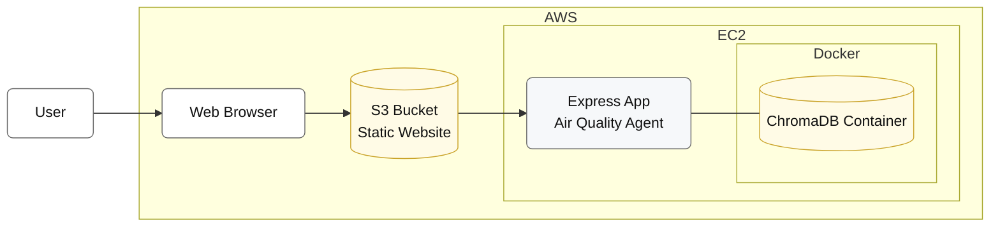
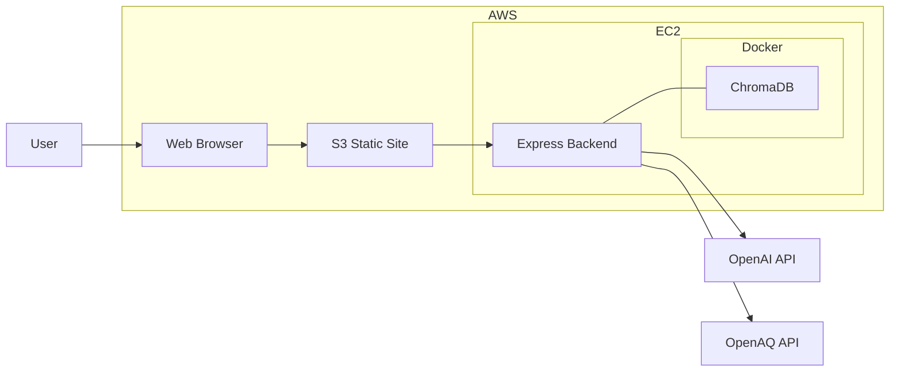
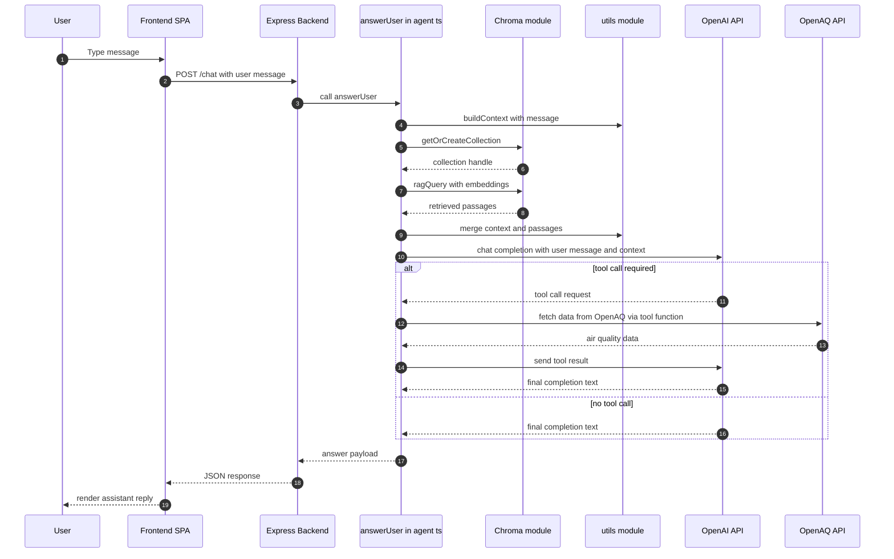

# Air Quality Agent

The Air quality agent does the following:

* Present a chat interface using which the user can interact with the system like chatting with a person.
* The user can ask questions related to air quality and pollution data which can be fetched by the system from publicly available APIs provided by OpenAQ.
* The system can ingest documents which contains information pertaining to air quality and pollutants.
* When asked questions, the system can fetch data from the API and from the data which it would have ingested earlier and use both to generate meaningful replies.

## Prerequisites

1. Docker
2. Nodejs

## Installation

The following instructions are meant for Unix/Linux but may be modified to work on Windows as well.

### 1. Docker

Install docker. Once docker is installed install chromadb using the following command:

```
docker run -d -v ./chroma-data:/data -p 8000:8000 chromadb/chroma
```

Check if chromadb is installed and running by doing:

```
docker ps
```

### 2. Node.js

Install nodejs - https://nodejs.org/en/download
Follow the installation instructions for your platform.

### Building and running the application locally

There are two directories besides this README file - backend and frontend. They need to be run separately.

### Running the backend

Inside the backend make a copy of the .env.local file and name it .env
Inside the .env file put your OPENAI_API_KEY and OPENAQ_API_KEY
Run the following commands in a terminal inside the backend directory to download the dependencies:

```
npm install
```

Chroma DB needs to be populated next by ingesting the data in the docs directory. For demo purposes this directory has markdown files. In a real life scenario, this could contain files in several different formats and the capability to ingest them would be built into the application. To ingest the documents, run this command:

```
npm run ingest
```

To build and run the application execute this command:

```
npm run build
npm run dev
```

### Running the frontend

Inside the frontend directory inside a terminal run the following command to install the dependencies.

```
npm install
```

To build and start the application run the following command:

```
npm run dev
```

The application would start on port 5173. If port 5173 is already used by some other process it will try to take up the next port and so on till it finds a free port. Its assumed that the application starts on port 5173(Which it would display after starting successfully on the terminal).

Open up the browser and go to the URL:

```
http://localhost:5173
```

### Asking questions

You may ask a question like - **What's the air quality like in Masachusettes?** or **What's the ozone level in New York City?** and the system would fetch data from openaq using the geolocation of the city you specify and then fetch related documents from chroma DB and the respond with both. At the end of the response it would also show the source documents as well as the function call parameters.

### Architecture Diagram:



### Architecture / component diagram (containers and data flow)



### Runtime sequence diagram for a single /chat request


